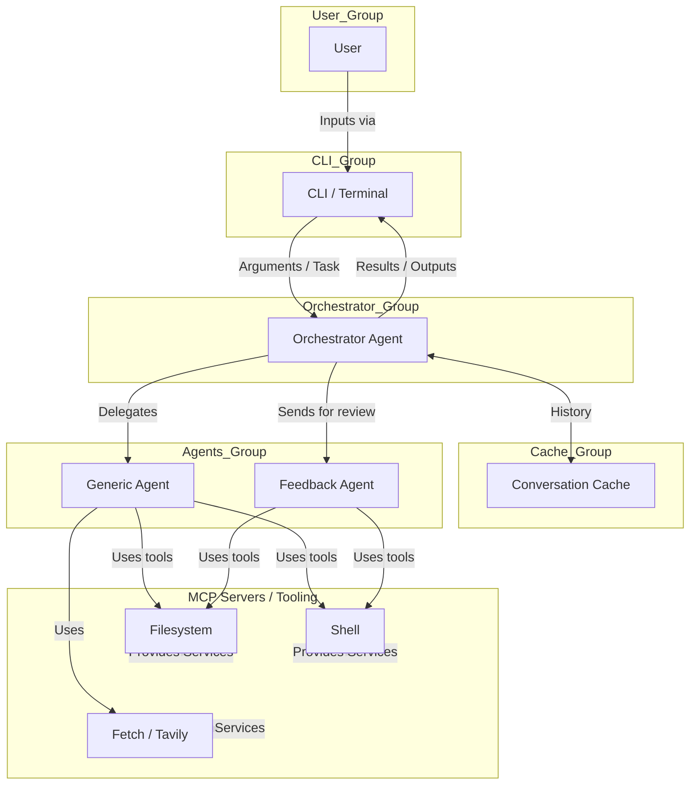

# Coding Assistant

## 🤖 Project Title: Coding Assistant

---

## Introduction

**Coding Assistant** is an advanced Python-based tool that leverages agent-based automation to streamline, support, and automate various coding tasks. It deploys multi-agent orchestration, research, automated development, feedback validation, and Model Context Protocol (MCP) tool integrations to tackle complex software engineering workflows efficiently and reliably. With agent roles specialized for distinct phases of software work, Coding Assistant optimizes developer productivity in real-world codebases.

---

## Key Features

- **Agent Orchestration**: The Orchestrator agent coordinates tasks by delegating work to specialized sub-agents as required.
- **Resume Functionality**: Resume work from a previous session, allowing the agent to continue its task without starting over.
- **Project-Specific Caching**: Conversation history and agent state are cached within a `.coding_assistant` directory in your project for easy access and version control.
- **Generic Agent System**: Flexible agent tool that can handle research, development, and analysis tasks based on provided instructions.
- **Feedback Agent**: Automatically reviews and validates agent results, ensuring they meet user requirements.
- **Flexible CLI**: Launch, control, and interact with agents/tasks from the command line.
- **MCP Server Integration**: Native support for MCP server toolchains (filesystem, fetch/web search, git, Tavily, etc).
- **Tracing with OpenTelemetry**: Optional tracing and observability via OpenTelemetry compatible endpoints.
- **Sandbox Security**: Landlock-based filesystem sandbox for secure task execution with configurable directories.

---

## Software Architecture

The Coding Assistant is structured as a multi-agent system coordinated via an Orchestrator. The user provides configuration, CLI inputs, or explicit tasks, which flow into the Orchestrator. The Orchestrator directs requests to specialized agent roles (Generic Agent, Feedback Agent), each leveraging MCP server tools for file access, shell commands, git, web search/fetch, and more. All task results are stored in conversation history and returned to the user through the CLI.



**Explanation:**
- **User interacts with the Coding Assistant through the CLI with command-line arguments.**
- **CLI passes arguments and tasks directly to the Orchestrator Agent.**
- **Conversation history is managed automatically (no config files needed).**
- **The Orchestrator delegates tasks to specialist agents (Generic Agent, Feedback Agent).**
- **Agents interact with external services (MCP Servers: Filesystem, Shell, Fetch/Tavily) as needed for their task.**
- **Results flow back through the Orchestrator to the CLI, and are shown to the user.**

---

## Installation Guide

### System Requirements
- **Python**: 3.12+ (see `.python-version`)
- **Node.js**: For running MCP servers (filesystem, Tavily).
- **Additional tools**: `uv`, `npx`, and optionally `git`, `npm`, `pytest`.

### 1. Clone the repository & enter the directory
```bash
git clone <REPO_URL>
cd coding_assistant
```

### 2. Set up a virtual environment
```bash
uv venv .venv
source .venv/bin/activate
```

### 3. Install dependencies
```bash
uv pip install -e .
```

### 4. Set environment variables
- Set up environment variables for API keys:
    - `OPENAI_API_KEY` (for OpenAI model access)
    - `GEMINI_API_KEY` (for Google Gemini models - recommended)
    - `ANTHROPIC_API_KEY` (optional, for Anthropic Claude models)
    - `DEEPSEEK_API_KEY` (optional, for DeepSeek models)
    - `TAVILY_API_KEY` (optional, for enhanced web research)

You can either:
- Use a `.envrc` file with direnv:
```bash
echo 'export GEMINI_API_KEY="your-key-here"' >> .envrc
direnv allow
```
- Or export them manually in your shell:
```bash
export GEMINI_API_KEY="your-key-here"
```

---

## Quickstart

### Launching the Orchestrator via CLI

The coding assistant uses a simple command-line interface with the `run.fish` script that provides sensible defaults and easy configuration.

#### Basic Usage:
```bash
./run.fish --task "Refactor all function names to snake_case."
```

#### Hello World:
```bash
./run.fish --task "Say 'Hello World'"
```

#### Resume Last Session:
```bash
./run.fish --task "Continue with the previous task." --resume
```

#### Print all available MCP tools:
```bash
./run.fish --print-mcp-tools
```

#### Advanced usage with custom configuration:
```bash
./run.fish \
    --model "gemini/gemini-2.5-flash" \
    --expert-model "gemini/gemini-2.5-pro" \
    --disable-feedback-agent \
    --disable-user-feedback \
    --instructions "Be concise and use modern Python patterns." \
    --sandbox-directories /tmp /mnt/wsl \
    --task "Update the README.md"
```

#### Using different models:
```bash
# Use OpenAI models
./run.fish --model "gpt-4o" --expert-model "o3" --task "Analyze this codebase"

# Use Anthropic models  
./run.fish --model "claude-3-5-sonnet-20241022" --task "Review code quality"
```

---

## Configuration

The coding assistant is configured entirely through command-line arguments - **no configuration files are needed**. This makes it simple to use and eliminates configuration management complexity.

### Command-Line Arguments

All configuration is passed via command-line flags:

#### Core Options:
- `--task`: The task for the orchestrator agent to execute (required unless using `--print-mcp-tools`)
- `--model`: LLM model for the main agent (default: `gpt-4.1`)
- `--expert-model`: LLM model for expert-level tasks (default: `o3`)

#### Agent Control:
- `--disable-feedback-agent`: Skip automatic feedback validation
- `--disable-user-feedback`: Skip user feedback prompts during execution
- `--instructions`: Custom instructions to append to all agents

#### Environment:
- `--sandbox-directories`: Directories to allow in sandbox mode (default: `/tmp`)
- `--disable-sandbox`: Completely disable sandboxing (use with caution)

#### MCP Servers:
- `--mcp-servers`: MCP server configurations as JSON strings (see MCP section below)
- `--print-mcp-tools`: Print all available tools and exit

### The `run.fish` Script

The included `run.fish` script provides sensible defaults for common usage:

```fish
#!/usr/bin/env fish

uv --project (dirname (status filename)) run coding-assistant \
    --model "gemini/gemini-2.5-flash" \
    --expert-model "gemini/gemini-2.5-pro" \
    --sandbox-directories /tmp /mnt/wsl \
    --mcp-servers \
        '{"name": "filesystem", "command": "npx", "args": ["-y", "@modelcontextprotocol/server-filesystem", "{working_directory}"]}' \
        '{"name": "fetch", "command": "uvx", "args": ["mcp-server-fetch"]}' \
    $argv
```

This script:
- Uses Gemini 2.5 models by default (cost-effective and fast)
- Includes standard sandbox directories
- Sets up filesystem and fetch MCP servers
- Passes through any additional arguments you provide

### Benefits of CLI-Only Configuration

- **No configuration drift**: Every run is explicit and reproducible
- **Easy to script**: Perfect for CI/CD and automation
- **Version control friendly**: Configuration is in your commands, not hidden files
- **Debugging friendly**: All settings are visible in the command line
- **Multi-environment**: Easy to use different settings for different projects

### Environment Variables

The following environment variables are used for API access:

#### Required (choose at least one):
- `OPENAI_API_KEY`: For OpenAI models (gpt-4o, o3, etc.)
- `GEMINI_API_KEY`: For Google Gemini models (gemini-2.5-flash, gemini-2.5-pro, etc.)
- `ANTHROPIC_API_KEY`: For Anthropic Claude models (claude-3-5-sonnet, etc.)

#### Optional:
- `DEEPSEEK_API_KEY`: For DeepSeek models
- `TAVILY_API_KEY`: For enhanced web research via Tavily MCP server

#### Proxy Support:
- `HTTPS_PROXY`: Automatically passed to MCP servers if set

**Note**: You only need to set the API key(s) for the model provider(s) you plan to use.

---

## Project Structure

```
coding_assistant/
├── src/
│   └── coding_assistant/
│       ├── __init__.py
│       ├── cache.py              # Conversation history management
│       ├── config.py             # User configuration system
│       ├── instructions.py       # Agent instruction handling
│       ├── llm/
│       │   └── model.py          # LLM model interface
│       ├── main.py               # CLI entry point
│       ├── mcp.py                # MCP server integration
│       ├── sandbox.py            # Sandbox implementation (Landlock)
│       ├── agents/
│       │   ├── tools.py          # All core agent/tool classes
│       │   ├── logic.py          # Agent orchestration logic
│       │   └── tests/            # Agent-specific tests
│       └── tests/                # Sandbox & integration tests
├── justfile                      # Development commands
├── pyproject.toml                # Dependencies and build configuration  
├── run.fish                      # Launch script with sensible defaults
├── README.md                     # This document
├── .python-version               # Python version specification
└── uv.lock                       # Dependency lock file
```

### Key Files

- **pyproject.toml**: Declares all dependencies and CLI entry point
- **run.fish**: Convenient script with sensible defaults for launching the assistant
- **justfile**: Development commands (`just test` for running tests)
- **cache.py**: Manages conversation history storage (no config files needed)
- **config.py**: Configuration data structures for runtime use

---

## Agent Types

### Orchestrator Agent
The main coordination agent that:
- Receives tasks from the CLI
- Delegates work to sub-agents
- Manages conversation history
- Coordinates feedback loops

### Generic Agent (AgentTool)
A flexible agent that can handle:
- Research tasks and information gathering
- Code development and implementation
- Analysis and documentation tasks
- Any task with clear instructions and expected output

### Feedback Agent
Specialized agent for:
- Reviewing and validating agent outputs
- Ensuring results meet user requirements
- Providing quality control and improvement suggestions

### Utility Tools
- **AskClientTool**: Interactive user input
- **ExecuteShellCommandTool**: Shell command execution
- **FinishTaskTool**: Task completion signaling

---

## MCP Server Integration

MCP (Model Context Protocol) servers provide the tools that agents use to interact with external systems. The coding assistant supports flexible MCP server configuration through command-line arguments.

### MCP Server Configuration

MCP servers are configured using JSON strings passed to the `--mcp-servers` argument:

```bash
./run.fish --mcp-servers \
    '{"name": "filesystem", "command": "npx", "args": ["-y", "@modelcontextprotocol/server-filesystem", "{working_directory}"]}' \
    '{"name": "fetch", "command": "uvx", "args": ["mcp-server-fetch"]}' \
    '{"name": "git", "command": "uvx", "args": ["mcp-server-git"], "env": ["GIT_AUTHOR_NAME", "GIT_AUTHOR_EMAIL"]}'
```

#### Configuration Format:
- `name`: Unique identifier for the server
- `command`: Executable command to start the server
- `args`: List of arguments (supports `{working_directory}` substitution)
- `env`: List of environment variable names to pass through (optional)

### Built-in MCP Servers

The `run.fish` script includes these servers by default:

#### Filesystem Server
- **Purpose**: File operations (read, write, list directories)
- **Command**: `npx -y @modelcontextprotocol/server-filesystem {working_directory}`
- **Requirements**: Node.js and npx

#### Fetch Server  
- **Purpose**: HTTP requests and web content fetching
- **Command**: `uvx mcp-server-fetch`
- **Requirements**: Python and uvx

### Optional MCP Servers

#### Git Server
Add git operations support:
```bash
--mcp-servers '{"name": "git", "command": "uvx", "args": ["mcp-server-git"]}'
```

#### Tavily Server (Web Research)
For enhanced web research (requires `TAVILY_API_KEY`):
```bash
--mcp-servers '{"name": "tavily", "command": "npx", "args": ["-y", "tavily-mcp@0.2.1"], "env": ["TAVILY_API_KEY"]}'
```

### Environment Variable Validation

**Important**: If you specify environment variables in the `env` list, they **must** be available in your environment. The system will fail with a clear error message if any required environment variable is missing.

---

## Development

### Testing
```bash
# Run all tests
just test

# Or directly with pytest
uv run pytest -n auto
```

### Code Style
- **Formatter**: Black with 120-character line length (see pyproject.toml)
- **Type hints**: Used throughout for clarity
- **Structure**: Dataclasses and structured configuration

### Test Locations
- `src/coding_assistant/agents/tests/` - Agent-specific tests
- `src/coding_assistant/tests/` - Core system tests

---

## Advanced Features

### Conversation History and Caching
- **Project-Specific Cache**: All conversation summaries and agent history are stored in a `.coding_assistant` directory within your project's working directory. This makes the context portable and specific to each project.
- **Resume Functionality**: The agent's state is saved, allowing you to resume a task from where you left off using the `--resume` flag.
- **Automatic Management**: The cache is managed automatically, with no configuration required.
- **Easy to Version Control**: Since the cache is in the project directory, you can choose to include it in your version control system to share context with your team.

### Sandboxing
- Landlock-based filesystem restrictions for security
- Configurable allowed directories via `--sandbox-directories`
- Can be disabled for development with `--disable-sandbox`
- Default: `/tmp` directory only

### Tracing and Observability
- OpenTelemetry integration for debugging
- Automatic detection of trace endpoint at `http://localhost:4318/v1/traces`
- Comprehensive span tracking for performance analysis

---

## Troubleshooting

### Common Issues

**Installation Problems:**
- Ensure Python 3.12+ is installed
- Use `uv pip install -e .` for installation
- Verify Node.js is available for MCP servers (`node --version`)

**API Key Errors:**
- Set required environment variables for your chosen model provider
- Verify API keys are valid and have sufficient credits/quota
- For Gemini: Ensure you have API access enabled in Google AI Studio

**Command-Line Issues:**
- Check that all required arguments are provided
- Use `./run.fish --help` to see available options  
- Ensure MCP server JSON configurations are valid

**Sandbox Errors:**
- Add required directories with `--sandbox-directories /path/to/dir`
- Use `--disable-sandbox` for debugging (not recommended for production)
- Check file permissions in the working directory

**MCP Server Issues:**
- Verify Node.js and npx are installed (`npx --version`)
- Check that uvx is available (`uvx --version`)  
- Ensure network connectivity for downloading MCP server packages
- If using environment variables in MCP config, ensure they're set

**Environment Variable Problems:**
- List all set environment variables: `env | grep -i key`
- Check if direnv is properly configured: `direnv status`
- Verify `.envrc` syntax if using direnv

### Getting Help
- Check agent logs for detailed error messages
- Review conversation history in cache directory
- Open issues on GitHub with reproduction steps

---

## License and Credits

- **License:** MIT
- **Contributions:** PRs and issues welcome. Please add tests for new functionality.
- **Architecture:** Built on MCP (Model Context Protocol) for tool integration
- **Security:** Landlock sandbox for safe code execution