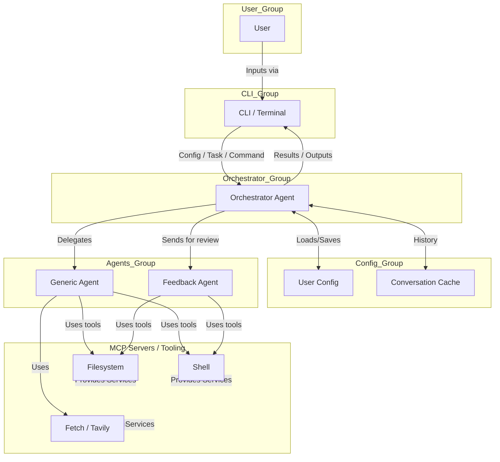

# Coding Assistant

## 🤖 Project Title: Coding Assistant

---

## Introduction

**Coding Assistant** is an advanced Python-based tool that leverages agent-based automation to streamline, support, and automate various coding tasks. It deploys multi-agent orchestration, research, automated development, feedback validation, and Model Context Protocol (MCP) tool integrations to tackle complex software engineering workflows efficiently and reliably. With agent roles specialized for distinct phases of software work, Coding Assistant optimizes developer productivity in real-world codebases.

---

## Key Features

- **Agent Orchestration**: The Orchestrator agent coordinates tasks by delegating work to specialized sub-agents as required.
- **Generic Agent System**: Flexible agent tool that can handle research, development, and analysis tasks based on provided instructions.
- **Feedback Agent**: Automatically reviews and validates agent results, ensuring they meet user requirements.
- **Flexible CLI**: Launch, control, and interact with agents/tasks from the command line.
- **MCP Server Integration**: Native support for MCP server toolchains (filesystem, fetch/web search, git, Tavily, etc). 
- **Configuration Management**: User configuration system with JSON-based settings and conversation history.
- **Tracing with OpenTelemetry**: Optional tracing and observability via OpenTelemetry compatible endpoints.
- **Sandbox Security**: Landlock-based filesystem sandbox for secure task execution with configurable directories.

---

## Software Architecture

The Coding Assistant is structured as a multi-agent system coordinated via an Orchestrator. The user provides configuration, CLI inputs, or explicit tasks, which flow into the Orchestrator. The Orchestrator directs requests to specialized agent roles (Generic Agent, Feedback Agent), each leveraging MCP server tools for file access, shell commands, git, web search/fetch, and more. All task results are stored in conversation history and returned to the user through the CLI.



**Explanation:**
- **User interacts with the Coding Assistant through the CLI.**
- **CLI collects user inputs and passes them to the Orchestrator Agent.**
- **Configuration and conversation history are managed automatically.**
- **The Orchestrator delegates tasks to specialist agents (Generic Agent, Feedback Agent).**
- **Agents interact with external services (MCP Servers: Filesystem, Shell, Fetch/Tavily) as needed for their task.**
- **Results flow back through the Orchestrator to the CLI, and are shown to the user.**

---

## Installation Guide

### System Requirements
- **Python**: 3.12+ (see `.python-version`)
- **Node.js**: For running MCP servers (filesystem, Tavily).
- **Additional tools**: `uv`, `npx`, and optionally `git`, `npm`, `pytest`.

### 1. Clone the repository & enter the directory
```bash
git clone <REPO_URL>
cd coding_assistant
```

### 2. Set up a virtual environment
```bash
uv venv .venv
source .venv/bin/activate
```

### 3. Install dependencies
```bash
uv pip install -e .
```

### 4. Set environment variables
- Copy or edit `.envrc` to provide API keys:
    - `OPENAI_API_KEY` (for OpenAI model access)
    - `TAVILY_API_KEY` (for web research)
    - `DEEPSEEK_API_KEY` (optional, for DeepSeek models)
    - `GEMINI_API_KEY` (optional, for Google Gemini models)
    - `ANTHROPIC_API_KEY` (optional, for Anthropic Claude models)

If using direnv:
```bash
direnv allow
```

---

## Quickstart

### Launching the Orchestrator via CLI

You can now run the coding assistant using the `run.fish` script, which simplifies the process of configuring and launching the agent.

#### Run an Orchestrator Task:
```bash
./run.fish --task "Refactor all function names to snake_case."
```

#### Print all available MCP tools:
```bash
./run.fish --print-mcp-tools
```

#### Example with all arguments:
```bash
./run.fish \
    --model "gemini/gemini-2.5-flash" \
    --expert-model "gemini/gemini-2.5-pro" \
    --disable-feedback-agent \
    --disable-user-feedback \
    --instructions "Be concise." \
    --sandbox-directories /tmp /mnt/wsl \
    --task "Update the README.md"
```

---

## Configuration

Configuration is now handled via command-line arguments, providing a more flexible and straightforward way to run the agent. The `run.fish` script provides a convenient way to pass these arguments.

### Command-Line Arguments

-   `--model`: The language model to use for the main agent (default: `gpt-4.1`).
-   `--expert-model`: The language model to use for the expert agent (default: `o3`).
-   `--disable-feedback-agent`: Disables the feedback agent.
-   `--disable-user-feedback`: Disables user feedback prompts.
-   `--instructions`: Custom instructions for the agent.
-   `--sandbox-directories`: A list of directories to include in the sandbox (default: `/tmp`).
-   `--disable-sandbox`: Disables the sandbox entirely.
-   `--mcp-servers`: A list of MCP server configurations as JSON strings.
-   `--print-mcp-tools`: Print all available tools from MCP servers.
-   `--task`: The task for the orchestrator agent.

### Environment Variables

Required/Optional environment variables:
- `OPENAI_API_KEY` (required for OpenAI models)
- `TAVILY_API_KEY` (required for web research functionality)
- `DEEPSEEK_API_KEY` (optional, for DeepSeek models)
- `GEMINI_API_KEY` (optional, for Google Gemini models)
- `ANTHROPIC_API_KEY` (optional, for Anthropic Claude models)

Place these in `.envrc` or export manually in your shell.

---

## Project Structure

```
coding_assistant/
├── src/
│   └── coding_assistant/
│       ├── __init__.py
│       ├── cache.py              # Conversation history management
│       ├── config.py             # User configuration system
│       ├── instructions.py       # Agent instruction handling
│       ├── llm/
│       │   └── model.py          # LLM model interface
│       ├── main.py               # CLI entry point
│       ├── sandbox.py            # Sandbox implementation (Landlock)
│       ├── tools.py              # MCP server & tool integration
│       ├── agents/
│       │   ├── agents.py         # All core agent/tool classes
│       │   ├── logic.py          # Agent orchestration logic
│       │   └── tests/            # Agent-specific tests
│       └── tests/                # Sandbox & integration tests
├── justfile                      # Development commands
├── pyproject.toml                # Dependencies and build configuration
├── README.md                     # This document
├── .envrc                        # Environment variables template
├── .python-version               # Python version specification
└── uv.lock                       # Dependency lock file
```

### Key Files

- **pyproject.toml**: Declares all dependencies and CLI entry point
- **justfile**: Development commands (`just test` for running tests)
- **.envrc**: Template for environment variables
- **cache.py**: Manages conversation history storage
- **config.py**: User configuration and settings management

---

## Agent Types

### Orchestrator Agent
The main coordination agent that:
- Receives tasks from the CLI
- Delegates work to sub-agents
- Manages conversation history
- Coordinates feedback loops

### Generic Agent (AgentTool)
A flexible agent that can handle:
- Research tasks and information gathering
- Code development and implementation
- Analysis and documentation tasks
- Any task with clear instructions and expected output

### Feedback Agent
Specialized agent for:
- Reviewing and validating agent outputs
- Ensuring results meet user requirements
- Providing quality control and improvement suggestions

### Utility Tools
- **AskClientTool**: Interactive user input
- **ExecuteShellCommandTool**: Shell command execution
- **FinishTaskTool**: Task completion signaling

---

## MCP Server Integration

The system initializes MCP servers based on the `--mcp-servers` command-line argument. The `run.fish` script provides a default configuration for the `filesystem` and `fetch` servers.

### Default MCP Servers in `run.fish`

-   **Filesystem Server**:
    -   **Name**: `filesystem`
    -   **Command**: `npx -y @modelcontextprotocol/server-filesystem {working_directory}`
    -   **Purpose**: File system operations and management.
-   **Fetch Server**:
    -   **Name**: `fetch`
    -   **Command**: `uvx mcp-server-fetch`
    -   **Purpose**: Web content fetching and HTTP requests.
-   **Tavily Server (Optional)**:
    -   To enable the Tavily server, you would add its configuration to the `$mcp_servers` variable in `run.fish`.
    -   **Requirement**: `TAVILY_API_KEY` environment variable.

---

## Development

### Testing
```bash
# Run all tests
just test

# Or directly with pytest
uv run pytest -n auto
```

### Code Style
- **Formatter**: Black with 120-character line length (see pyproject.toml)
- **Type hints**: Used throughout for clarity
- **Structure**: Dataclasses and structured configuration

### Test Locations
- `src/coding_assistant/agents/tests/` - Agent-specific tests
- `src/coding_assistant/tests/` - Core system tests

---

## Advanced Features

### Conversation History
- Automatically stored in `~/.config/coding_assistant/cache/`
- Maintains context across sessions
- Used for agent learning and improvement

### Sandboxing
- Landlock-based filesystem restrictions
- Configurable allowed directories
- Can be disabled for development with `--disable-sandbox`

### Tracing and Observability
- OpenTelemetry integration
- Automatic detection of trace endpoint at `http://localhost:4318/v1/traces`
- Comprehensive span tracking for debugging

---

## Troubleshooting

### Common Issues

**Installation Problems:**
- Ensure Python 3.12+ is installed
- Use `uv pip install -e .` instead of requirements.txt
- Verify Node.js is available for MCP servers

**API Key Errors:**
- Check `.envrc` file exists and is loaded
- Verify API keys are valid and not expired
- Ensure direnv is installed and allowed if using `.envrc`

**Sandbox Errors:**
- Add required directories to `sandbox_directories` in config
- Use `--disable-sandbox` for debugging
- Check file permissions in working directory

**MCP Server Issues:**
- Verify Node.js installation
- Check `npx` is available in PATH
- Ensure network connectivity for package downloads

**Configuration Problems:**
- Check `~/.config/coding_assistant/config.json` exists
- Verify JSON syntax is valid
- Reset config by deleting file (will regenerate defaults)

### Getting Help
- Check agent logs for detailed error messages
- Review conversation history in cache directory
- Open issues on GitHub with reproduction steps

---

## License and Credits

- **License:** MIT
- **Contributions:** PRs and issues welcome. Please add tests for new functionality.
- **Architecture:** Built on MCP (Model Context Protocol) for tool integration
- **Security:** Landlock sandbox for safe code execution